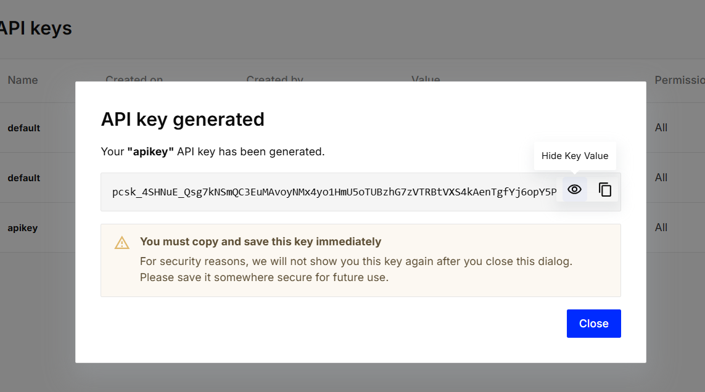

# AREP_TALLER08-LLM

# Build a simple LLM application with chat models and prompt templates

## Descripción

En esta guía de inicio rápido, le mostraremos cómo crear una aplicación LLM sencilla con LangChain. Esta aplicación traducirá texto del inglés a otro idioma. Es una aplicación LLM relativamente sencilla: solo requiere una llamada LLM y algunas indicaciones. Aun así, es una excelente manera de comenzar con LangChain: ¡se pueden crear muchas funciones con solo algunas indicaciones y una llamada LLM!

---

## Arquitectura y Componentes del Proyecto

La aplicación se estructura por medio de los siguientes componentes:

- **Modelo de Lenguaje:** Es el elemento central encargado de realizar las traducciones, en este caso, se utiliza el modelo GPT de OpenAI.
- **Plantillas de Instrucciones:** Facilitan la organización de la entrada para el modelo de lenguaje, fusionando instrucciones predefinidas con los datos proporcionados por el usuario.
- **Interfaz de Transmisión:** Permite la transmisión en tiempo real de los tokens generados por el modelo.
- **Configuración del Entorno:** Contiene las indicaciones necesarias para la instalación y configuración de la clave API.


---

## Instalación y Configuración

Sigue estos pasos para configurar y ejecutar el código:

### Requisitos Previos
- Python 3.8 o superior
- OpenAI API key.
- Pinecone API key.

  

###  Clona el Repositorio
```bash
git clone https://github.com/tu-usuario/langchain-tutorials.git
```

### Dependencias
```bash
pip install langchain
!pip install langchain-openai
```


1) **Configuración la Clave API de OpenAI:** 

   Configuramos las claves API de OpenAI. La key de OpneAI fue dada por el profesor.

   **Clave API de OpenAI:**
   ```python
   output: false
   echo: false
    import os

    from langchain_openai import ChatOpenAI
    os.environ["OPENAI_API_KEY"] = ""

    model = ChatOpenAI(model="gpt-4o-mini")
   ```


2) **Mensajes del modelo**

Utilizamos un modelo de lenguaje para traducir un mensaje ("hi!") del inglés al español, utilizando un mensaje de sistema para definir la tarea de traducción.

```python
from langchain_core.messages import HumanMessage, SystemMessage

messages = [
    SystemMessage("Translate the following from English into Spanish"),
    HumanMessage("hi!"),
]

model.invoke(messages)
```

3) **Traducción generada**

Se imprime la traducción del mensaje ("hi!") del inglés al español en tiempo real, mostrando cada token generado por el modelo separado por un carácter "|".

```python
for token in model.stream(messages):
    print(token.content, end="|")
```


4) **Creación de prompt**

Se crea una plantilla de prompt para traducción, permitiendo personalizar el idioma de destino y el texto a traducir mediante variables.

```python
from langchain_core.prompts import ChatPromptTemplate

system_template = "Translate the following from English into {language}"

prompt_template = ChatPromptTemplate.from_messages(
    [("system", system_template), ("user", "{text}")]
)
```

5) **Generación prompt**

Se genera un prompt personalizado para traducir "hi!" al español, utilizando una plantilla que permite definir el idioma y el texto a traducir

```python
prompt = prompt_template.invoke({"language": "Spanish", "text": "hi!"})

prompt
```

6)  **Revisar la Plantilla**

Se revisa la organización la entrada en la plantilla
```python
prompt.to_messages()
```

7) **Impresión mensaje**
   Se convierte el prompt en mensajes, lo envía al modelo para obtener una respuesta, e imprime la traducción generada ("¡hola!").

```python
response = model.invoke(prompt)
print(response.content)
```


